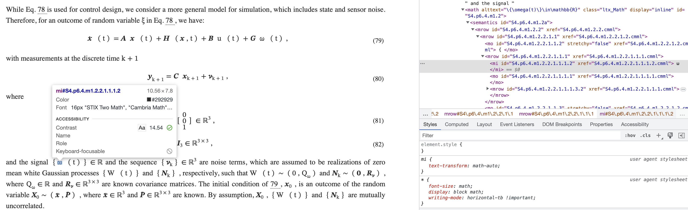
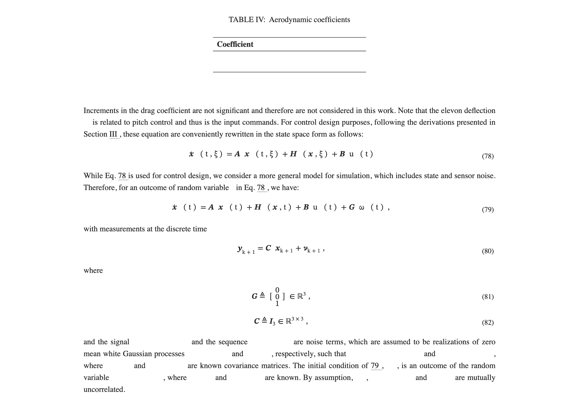

## Description

This is a flask demo for the ArXiv bug report function. The bug report initiation could be done in two ways(screenshot and highlight). The link to design document is [figma ArXiv-Error-report Desgin](https://www.figma.com/file/p13ZktQJEV8CXx3M7Z10fe/ArXiv-Error-report?node-id=0%3A1&t=gEav7Q8shh8D9Du0-1).

## Run the code

#### if you want to use virtualenv:
`python3 -m venv venv`

#### activate env
`source venv/bin/activate`

#### Install Dependencies

`pip install Flask, requests, Flask-SQLAlchemy, flask-cors`

#### Create database

run a python interactive shell

- `from app import db`
- `db.create_all()`
- `exit()`

#### Start Server

Start the server by `python(python3) app.py` or `flask --app app run`

## Features
1. Develop web base on Flask, backend on Python, CSS on  bootstrap with ArXiv defualt css , and database on SQLite. 

2. Screenshot (Use Html2canvas)

3. Use shortcut to control report box

   a. "p" or "P" or  "Command + /"  or "Command + ?" to open report box.

   b.  "i" or "I" or "Command + ." or "Command + >" to close report box.

4. Build a floating button at right buttom corner, can be clicked to open the report box. 

5. After Select Text auto show up report button. After click report button will auto take screenshot and get select HTML File.

6. Highlight

7. The screenshot image can be zoom up.

8. In Report box, people can add comments, attach file, and take screenshot (this function will auto close report box and reopne). And send it to backend.

9. Use SQLite as backend database, get report information from frontend.  
   Here is the information list:

   - Article_url: url for Ar5iv article
   - User_info: Not we set default to some value.
   - report time: time it generated.
   - Browser_info: the user's browser info
   - Description: user can write in Report Box
   - Conversion_report: Log(from pdf to html) prepare for developer
   - source file: the orginal article url
   - Attachment: User can attatchment any type of file in report box they think it is useful.
   - Screenshot
   - Selected html: use selected function to capture the html of selected text.
   - Location_low: the selected element identifier
   - Location_high: the parent node.

10. After submit, we will auto close the report box.

## Future work & Current Problem
### Urgent and important

1. **Implement the DOM capture (get top level element and most specific element)**
2. Clean the data in report box after close it!
4. **implement browser version info from javascript** : You use what kind of browser, and if it will success or not!

#### Do it in "recent" future

1. Test Highlight Function: Related to 5. So Try to solve 5a!
   1. test highlight merged author/dept
   2. test highlight equation
   3. test highlighting words with extra chars like:
      1. \ANDAshish Vaswani
      2. Noam Shazeer1
2. Report Mode for ScreenReader.

#### Future work

1. Show the demo to our users and optimize the user experience based on their feedback
2. Issues with screenshot functionality: Firstly, some characters cannot be captured (likely due to HTML2Canvas limitations), and secondly, in split-screen mode, the screenshot position shifts downwards.
   Solution?: Change document.nody to document.element. But the screenshot will become empty. Do not know why yet!

## Develop Log Current

#### Using Keyboard Shortcuts to Open and Close the Report Box

In web development, it's sometimes necessary to solicit feedback from users or allow them to report issues. To make it easier for users to submit feedback, we can add a report box to the page where they can enter their comments or upload screenshots.

To make it convenient for users to open and close the report box, we can use keyboard shortcuts. On Windows, users can press "Ctrl + /" to open the report box and "Ctrl + ." or ">" to close it. On Mac, users can press "Command + /" to open the report box and "Command + ." or ">" to close it.

#### Auto Capture Selected HTML.
After user select text and click report button. We will auto capture the selected HTML.  

#### Add backend database

Click submit button will send data to the backend database. We have included attachment file, screenshot, id, article title, comments, user id and contact info, selected html, etc.

#### Add Highligh back

We remove the capture div to highlight for  selected screenshot function. But we have kept the method of created html for selected element.

#### Fix Small Bug for Report Box and Add auto closs function

We remove the downlaod function we have added before. Fix the bug for highlight. Fix the bug for zoom the picture. 

We clean up the report box after submit or user close it. And it will auto close.

## Develop Log 4/15 - 4/21
1. **BIG Update** to the components, we have now implemented Bootstrap. The report box now has a brand new look. We have reorganized and refactored the JS files, including removing unnecessary code. The report box now has a streamlined appearance that can be easily tested, and we will continue to build upon this framework for future code updates.
2. Investigating fast screenshot plugins or features. Puppeteer? dom-to-image? HTMLcanvas2 is in experimental stage, Puppeteer only provides help for some browsers, and dom-to-image doesn't work. Further research is needed. https://github.com/niklasvh/html2canvas
3. The previous Report box would retain the previous screenshot, but with this update, the screenshot is removed every time the report box is closed.
4. Adding a functionality to download the screenshot locally, hoping to further confirm if the screenshot is complete and clear.
5. The unclear screenshot issue is caused by changing the scale. After designing the new report box, the scale was changed back to the old one, making it clear again. I also found that some fonts cannot be captured, which is likely due to them being re-rendered later. Tried using rasterizeHTML, but it was not successful.

6. We made the screenshot in the form clickable. By clicking on the screenshot, it will be enlarged so that users can see the details on it.
7. The screenshot could not show the exact contents that are highlighted by the users before. After modifying, the selected texts stay highlighted in the screenshot.
8. Fix the problem of bug button keeps floating. Now when we scroll the page, the report button that generated by select text will disappear. 
9. Fix the issue of the report box not appearing after selecting text and clicking the button. When the report button is clicked, the mouse release (`mouseup`) event is triggered before the click (`click`) event. As a result, during the processing of the `mouseup` event, the button is removed, preventing the `click` event from triggering properly.
